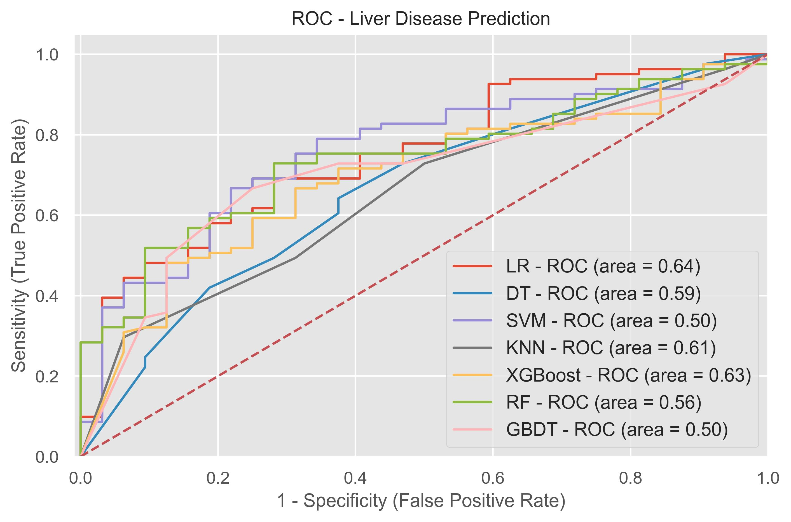
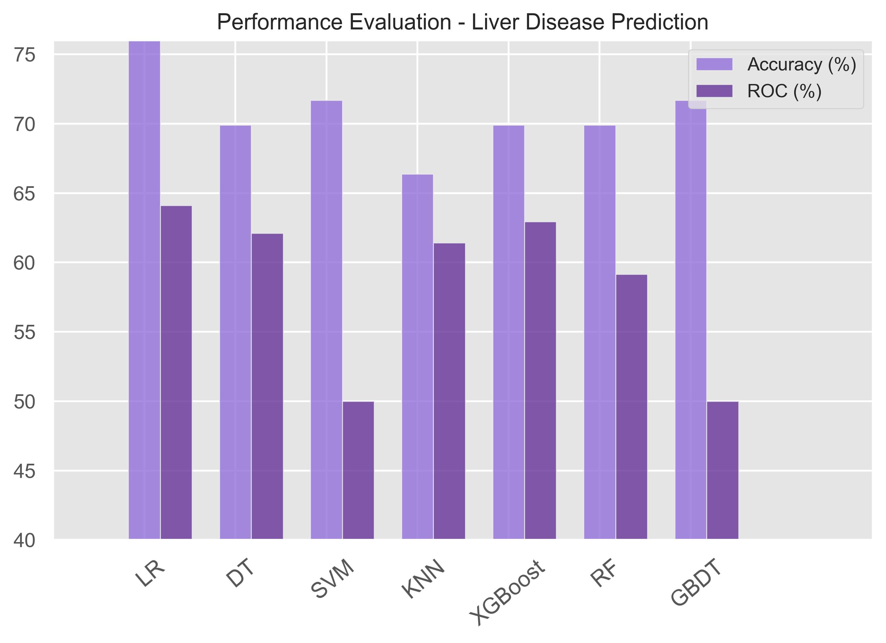

# Liver Disease Prediction Project

## Introduction

This project aims to predict liver disease using various machine learning models. The dataset used in this project contains information on liver patients and healthy individuals. The target variable is `Dataset`, where 1 indicates liver disease and 0 indicates no liver disease.

## Dataset

- **Source:** The dataset used for this project is `liver.csv`.
- **Target Variable:** `Dataset`
- **Features:**
  - Age
  - Gender
  - Total_Bilirubin
  - Direct_Bilirubin
  - Alkaline_Phosphotase
  - Alamine_Aminotransferase
  - Aspartate_Aminotransferase
  - Total_Protiens
  - Albumin
  - Albumin_and_Globulin_Ratio

## Exploratory Data Analysis (EDA)

- **Shape of Dataset:** The dataset consists of a certain number of rows and columns.
- **Distribution of Numerical Features:** The distribution of numerical features is visualized using histograms.
- **Handling Categorical Features:** The `Gender` feature is encoded, where Male is mapped to 0 and Female to 1.
- **Correlation Analysis:** A heatmap is used to visualize the correlation between features.

## Data Preprocessing

- **Outlier Removal:** Outliers in the `Aspartate_Aminotransferase` feature are handled by setting a threshold value.
- **Missing Values:** Rows with missing values are dropped.
- **Data Standardization:** The features are standardized to have zero mean and unit variance.

## Machine Learning Models

The following machine learning models are implemented and evaluated:

1. **Logistic Regression**
2. **K-Nearest Neighbors (KNN)**
3. **Support Vector Classifier (SVC)**
4. **Decision Tree Classifier**
5. **Random Forest Classifier**
6. **Gradient Boosting Classifier**
7. **XGBoost Classifier**

### Model Training and Evaluation

- **Train-Test Split:** The dataset is split into training and testing sets with an 80-20 ratio.
- **Hyperparameter Tuning:** Grid search is used to find the best hyperparameters for SVC, Decision Tree, and Gradient Boosting models.
- **Model Performance Metrics:** Accuracy, confusion matrix, and classification report are used to evaluate the models.

### Model Performance

| Model                        | Accuracy (%) | ROC-AUC (%) |
|------------------------------|--------------|-------------|
| Logistic Regression          | 71.60        | 76.53       |
| K-Nearest Neighbors (KNN)    | 69.72        | 74.60       |
| Support Vector Classifier (SVC) | 70.83     | 75.71       |
| Decision Tree Classifier     | 65.97        | 68.32       |
| Random Forest Classifier     | 72.92        | 77.30       |
| Gradient Boosting Classifier | 70.83        | 75.94       |
| XGBoost Classifier           | 73.61        | 77.91       |

### Model Comparison

The models are compared based on their accuracy and ROC-AUC scores. The best-performing model is the **XGBoost Classifier** with an accuracy of 73.61% and an ROC-AUC score of 77.91%.

## Conclusion

The project successfully demonstrates the use of various machine learning models to predict liver disease. The XGBoost Classifier is found to be the best model based on accuracy and ROC-AUC scores.

## Visualizations

### ROC Curve



### Performance Evaluation



## Saving the Model

The best model (XGBoost Classifier) is saved using pickle for future use.

```python
import pickle
model = xgb
pickle.dump(model, open("liver.pkl", "wb"))
